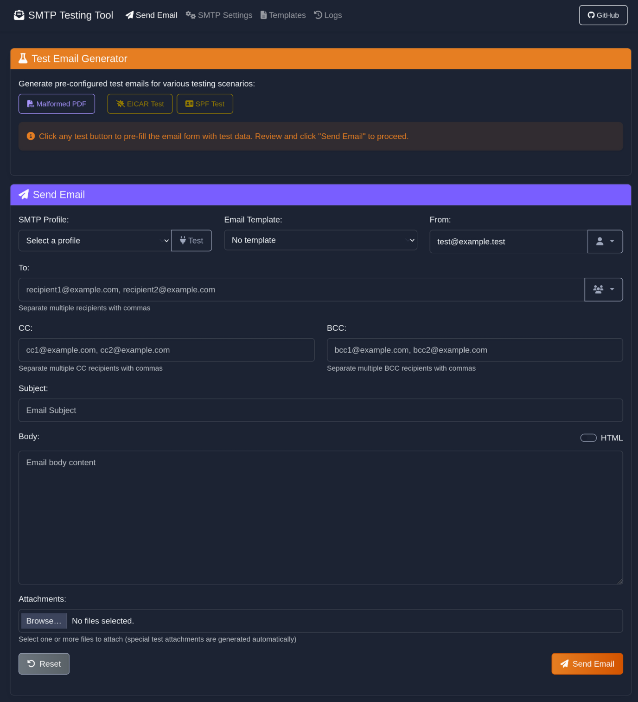
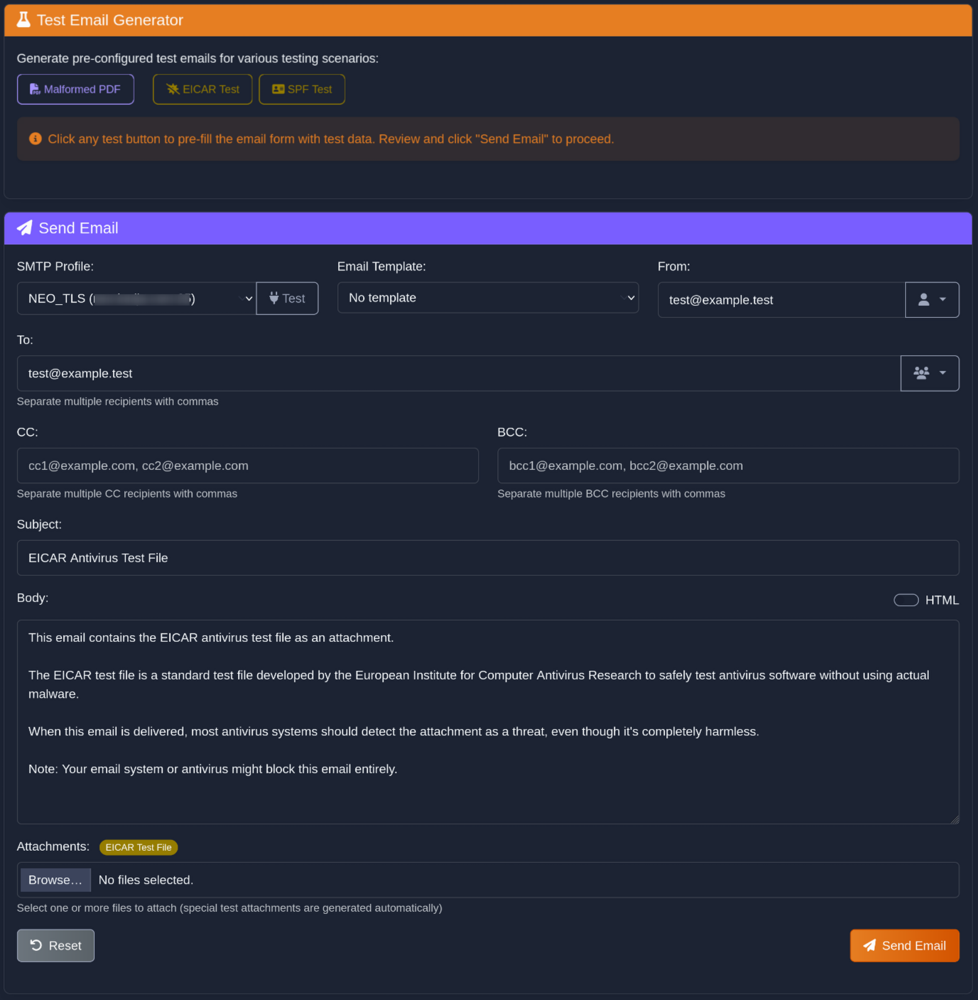
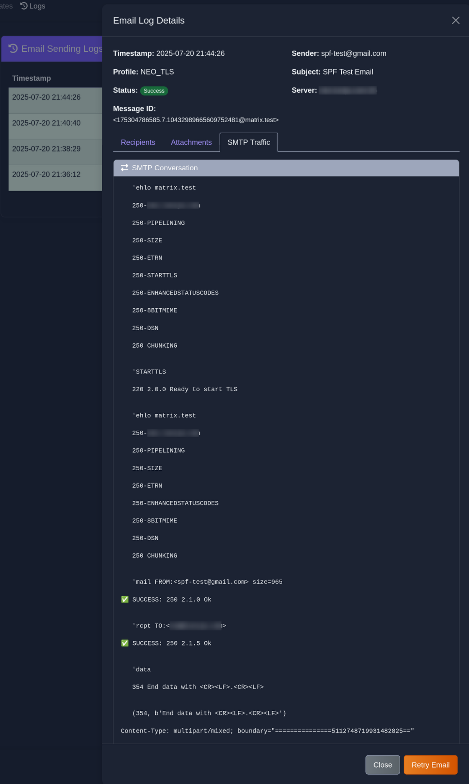

## NOTE: **SPF and DKIM preconfigured test emails not complete yet i.e. SPF "only" triggers SPF softfail, DKIM does the same.**

# SMTP Testing Tool

A robust SMTP testing and email sending utility designed for Docker, providing comprehensive email configuration, validation, and advanced email authentication testing capabilities.



## Features

- **Web GUI** with intuitive and customizable design
- **CLI support** for scripting and automation
- **Advanced email validation** testing (DKIM, SPF, DMARC)
- **Template management** for reusing common email formats
- **Responsive UI** with customizable orange theme

## Quick Start

### Running with Docker

1. Clone the repository
2. Run with Docker Compose:
   ```
   docker-compose up -d
   ```
3. Access the web interface at http://localhost:5000

## Features

### Email Testing



- Send test emails with customizable settings
- Test SPF, DKIM, and DMARC configurations
- Create and use email templates
- Attach files to test emails

### SMTP Profile Management


- Save and manage multiple SMTP server profiles
- Test connection to SMTP servers
- Configure TLS/SSL options

### Logging and History



- View detailed logs of sent emails
- Monitor success and error rates
- Filter and search through email history

## Docker Support

The application includes Docker support for easy deployment, with persistent volumes for:
- Configuration data
- Email templates
- Logs

## License

This project is open source under the MIT license.