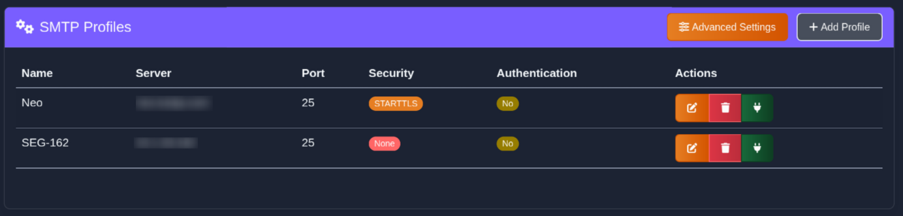
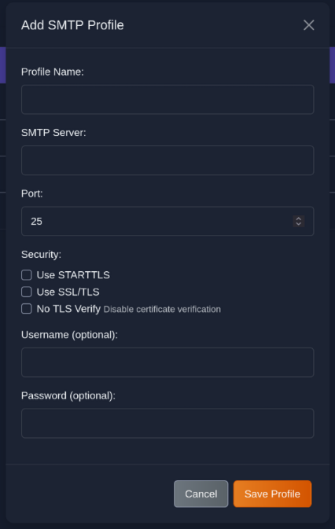
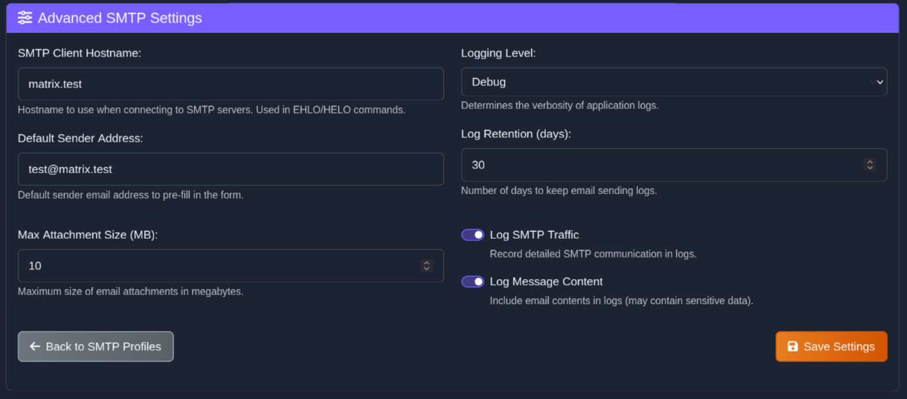

> NOTE: *SPF "only" triggers SPF softfail.*


# SMTP Testing Tool - beta

A SMTP testing tool designed for Docker, providing comprehensive email configuration, validation, and advanced email authentication testing capabilities.


## Features

- ***Web GUI** *with intuitive and customizable design*
- ***Email validation** *testing *SPF *see NOTE:*
- ***Template management** *for reusing common email formats*
- ***Responsive UI** *with customizable orange theme*

## Quick Start

### Running with Docker

1. Clone the repository
2. Run with Docker Compose:

   ```
   docker compose up -d
   ```
3. Access the web interface at http://localhost:5000

## Features

* ### Email Testing


- *Send test emails with customizable settings*
- *Test SPF, Eicar Test Virus*
- *Create and use email templates*
- *Attach files to test emails*

* ### SMTP Profile Management








- *Save and manage multiple SMTP server profiles*
- *Test connection to SMTP servers*
- *Configure TLS/SSL options*
- *Skip certificate verification*
- *Configure SMTP Authentication*

* ### Logging and History


- *View detailed logs of sent emails*
- *Monitor success and error rates*
- *Filter and search through email history*

## Docker Support

The application includes Docker support for easy deployment, with persistent volumes for:
- *Configuration data*
- *Email templates*
- *Logs*

## License

This project is open source under the MIT license.
